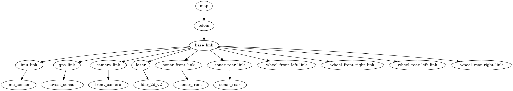

# Rover Ackermann ROS2-PX4

This project configures and integrates an Ackermann autonomous rover using the ROS 2 ecosystem, PX4 Autopilot (Gazebo SITL), SLAM, and Nav2 to perform navigation, mapping, and simulation tasks.

## Project Structure

The workspace contains the following main ROS 2 packages:

```text
rover_ackermann/
│
├── src/                          # Directory containing ROS 2 packages and related libraries
│   ├── ackermann_iot_bridge/    # IoT communication bridge for the Ackermann rover
│   ├── ackermann_nav2_behaviors/# Custom behavior and plugin support for Nav2
│   ├── ackermann_rover_bringup/ # Launch files and startup configuration for the system
│   ├── ackermann_rover_msgs/    # Custom ROS 2 message definitions
│   ├── m-explore-ros2/          # Extended map exploration library
│   ├── Micro-XRCE-DDS-Agent/    # DDS bridge between PX4 and ROS 2
│   ├── px4-ros2-interface-lib/  # Integration library for PX4 and ROS 2
│   └── px4_msgs/                # PX4 message definitions exposed to ROS 2
│
├── results/                      # Experimental results and trajectory records
├── video/                        # Simulation videos
├── run_all.sh                    # Script to start the full system
├── README.md                     # Project documentation
└── yolov8n.pt                    # Object detection model used in the project
```


## Features

### 1. Ackermann Steering
Implements Ackermann steering geometry for the rover, providing precise control over vehicle movement. The steering model accounts for front wheel angle and rear axle position to achieve accurate trajectory tracking.

### 2. ROS2 - PX4
Seamless integration between ROS 2 and PX4 Autopilot through Micro-XRCE-DDS bridge. Enables communication between high-level navigation tasks in ROS 2 and low-level vehicle control in PX4.

### 3. Sensor
Equipped with multiple sensors including:
- **LiDAR**: 2D laser scanner for obstacle detection and mapping
- **Camera**: Front-facing camera for visual perception
- **IMU**: Inertial measurement unit for attitude estimation
- **GPS**: GNSS positioning 
- **Odometry**: Wheel encoders for odometry estimation

### 4. SLAM
SLAM Toolbox integration enables simultaneous localization and mapping. The rover can build a map of its environment while determining its position within that map in real-time.

### 5. Navigation
Nav2 framework provides autonomous navigation capabilities including:
- Path planning and trajectory optimization
- Obstacle avoidance and recovery behaviors
- Waypoint navigation and goal management

### 6. Visualization
RViz2 visualization tool displays:
- Real-time sensor data (LiDAR scans, camera feed)
- Transformation frames (TF tree)
- Planned paths and trajectories
- Cost maps and navigation states


## Requirements

- **OS**: Ubuntu 22.04
- **ROS 2**: ROS 2 Humble
- **PX4 Autopilot**: v1.16
- **Micro-XRCE-DDS-Agent**: v3.0.1


## Usage

### Build workspace

```bash
cd ~/rover_ackermann
colcon build
source install/setup.bash
```

### SLAM & Navigation

### Navigation with Pre-built Map

This mode uses a previously scanned map for autonomous navigation. The rover localizes itself on the existing map and performs path planning without needing to build a new map.

```bash
./run_all_map_behaviors.sh 
```

<video controls width="640" height="360">
	<source src="video/behaviors.mp4" type="video/mp4">
	Your browser does not support the video tag.
</video>


## TF Tree

 


